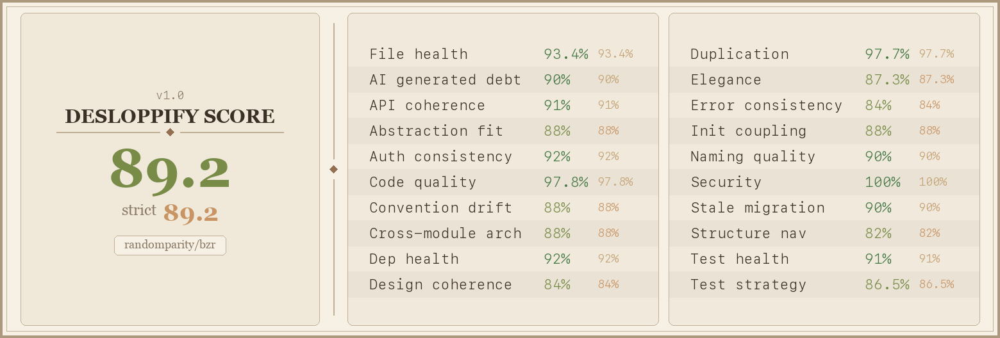

# bzr - Bugzilla CLI

[](https://github.com/randomparity/bzr/actions/workflows/ci.yml)
[](https://sonarcloud.io/summary/new_code?id=randomparity_bzr)
[](LICENSE)
[](https://blog.rust-lang.org/2025/01/09/Rust-1.84.0.html)
[](https://crates.io/crates/bzr)

A command-line interface for Bugzilla servers, written in Rust. Inspired by the GitHub CLI (`gh`), `bzr` lets you search, view, create, and update bugs, manage comments and attachments, and switch between multiple Bugzilla instances — all from your terminal.

## Features

- **Bug management** — list, search, view, create, clone, update, and batch-update bugs; view change history
- **Bug workflow** — view your bugs (`bzr bug my`), save reusable field templates, and run saved queries
- **Comments** — list and add comments, with `$EDITOR` integration for composing
- **Comment tags** — add, remove, and search comment tags
- **Attachments** — list, download, upload, and update file attachments with auto-detected MIME types
- **Flags** — set, request, and clear flags on bugs and attachments
- **Products** — list, view, create, and update products
- **Components** — create and update product components
- **Classifications** — view classification details
- **Fields** — look up valid values for bug fields (status, priority, severity, etc.)
- **Users** — search, create, and update users
- **Groups** — list members, add/remove users, view, create, and update groups
- **Server diagnostics** — check server version and extensions (`whoami`, `server info`)
- **Admin operations** — create and update products, components, users, and groups
- **Multi-server** — configure and switch between multiple Bugzilla instances
- **Output formats** — human-readable tables (with colored status) or JSON for scripting
- **Secure auth** — API key sent via `X-BUGZILLA-API-KEY` header by default; falls back to query parameter auth for older servers

## Installation

### Pre-built binaries

Download the latest release for your platform from
[GitHub Releases](https://github.com/randomparity/bzr/releases/latest).

Available platforms: Linux (x86_64, aarch64, ppc64le, s390x), macOS (Apple Silicon), Windows (x86_64, aarch64).

Intel Mac users can install from source with `cargo install bzr --locked`.

### Homebrew (macOS, Linux)

```bash
brew tap randomparity/tap
brew install bzr
```

The tap ships pre-built binaries for macOS arm64 and Linux x86_64/aarch64.
Intel Mac builds from source automatically (a `rust` build dependency is
pulled in for that path).

### Linux packages (`.deb` / `.rpm`)

Each release attaches `.deb` and `.rpm` packages alongside the tarballs:

- `.deb` for `amd64`, `arm64`, `ppc64el`
- `.rpm` for `x86_64`, `aarch64`, `ppc64le`, `s390x`

Install on Debian/Ubuntu:

```bash
sudo apt install ./bzr_X.Y.Z-1_amd64.deb
```

Install on Fedora/RHEL:

```bash
sudo dnf install ./bzr-X.Y.Z-1.x86_64.rpm
```

Both packages install the binary, manpages under `/usr/share/man/man1/`, and
documentation under `/usr/share/doc/bzr/`. They depend on `libdbus-1-3`
(Debian) / `dbus-libs` (RPM) for the OS keychain backend.

### From crates.io

```bash
cargo install bzr --locked
```

The `--locked` flag tells cargo to use the exact dependency versions
published in `Cargo.lock`, which are tested against the MSRV. Without it,
cargo re-resolves to newer transitive dependencies that may exceed the MSRV
and fail to build.

### From source

```bash
cargo install --path . --locked
```

Requires Rust 1.84+.

### OS keychain support (`keyring` feature)

`bzr` can store per-server API keys in the OS keychain (macOS Keychain,
GNOME Keyring / KWallet via Secret Service on Linux, Windows Credential
Manager). This is provided by the `keyring` Cargo feature, which is
**enabled by default** — the install commands above give you keychain
support automatically. See [Credential storage](#credential-storage)
below for how to use it.

On headless Linux systems without a running Secret Service daemon
(servers, containers, CI runners), you can opt out of the feature to
avoid pulling in `libdbus-1` at build time:

```bash
cargo install bzr --locked --no-default-features
```

A build without the feature still supports plaintext and environment
variable credentials; only the `config set-keyring` /
`migrate-to-keyring` subcommands become unavailable. See
[`docs/troubleshooting.md`](docs/troubleshooting.md) for diagnosing
keychain errors.

### Manual pages

Release tarballs ship roff manpages under `man/man1/` (`bzr.1`, `bzr-bug.1`,
`bzr-bug-list.1`, ...). Install them manually:

```bash
sudo install -Dm644 man/man1/bzr.1 /usr/local/share/man/man1/bzr.1
sudo install -Dm644 man/man1/bzr-*.1 /usr/local/share/man/man1/
sudo mandb   # or `sudo makewhatis` on BSD
```

The `.deb` and `.rpm` packages install them automatically. `cargo install bzr`
does **not** install manpages — use a release tarball or distro package, or
regenerate from a source checkout with `make man`.

## Onboarding

If you are new to `bzr`, this is the fastest path from install to a working Bugzilla session.

### 1. Install `bzr`

Use a release binary from [GitHub Releases](https://github.com/randomparity/bzr/releases/latest), install from crates.io, or install from source:

```bash
cargo install bzr --locked
```

For a local source checkout:

```bash
cargo install --path . --locked
```

### 2. Configure your first server

```bash
# Preferred: read the API key from an environment variable
export BZR_API_KEY=YOUR_API_KEY
bzr config set-server myserver --url https://bugzilla.example.com --api-key-env BZR_API_KEY

# For Bugzilla 5.0 or earlier (XMLRPC)
bzr config set-server myserver --url https://bugzilla.example.com --api-key-env BZR_API_KEY --email "user@example.com"

# Legacy/insecure: stores the API key in config.toml and may leak via shell history
bzr config set-server myserver --url https://bugzilla.example.com --api-key YOUR_API_KEY
```

To store the API key in your OS keychain instead of an env var, see
[Credential storage](#credential-storage).

### 3. Verify authentication

```bash
bzr whoami
bzr server info
```

### 4. Run your first queries

```bash
# List the user's open bugs
bzr bug my --status \!CLOSED

# List open bugs in a product
bzr bug list --product MyProduct --status NEW

# View a specific bug
bzr bug view 12345

# Search across bugs
bzr bug search "crash on startup"
```

### 5. Save time with local workflows

```bash
# Save a reusable bug template
bzr template save fedora-kernel --product Fedora --component kernel

# Create a bug from the template
bzr bug create --template fedora-kernel --summary "Boot failure on 6.x" --description "System fails to boot after upgrade"

# Save a reusable query
bzr query save my-open-bugs --assignee you@example.com --status NEW --status ASSIGNED

# Run the saved query later
bzr query run my-open-bugs
```

## Quick Start

```bash
# Common day-to-day commands
bzr bug history 12345 --since 2025-01-01
bzr bug update 12345 --status RESOLVED --resolution FIXED --flag "review+(alice@example.com)"
bzr comment add 12345 --body "I can reproduce this on Fedora 42"
bzr comment tag 98765 --add needs-info
bzr attachment upload 12345 patch.diff --flag "review?(alice@example.com)"
bzr product list
bzr product view MyProduct
bzr user search "alice"
bzr group add-user --group testers --user alice@example.com
```

## Testing

For regular validation:

```bash
cargo test
make functional-test-all
```

To reproduce the CI coverage summary locally:

```bash
cargo install cargo-llvm-cov
rustup component add llvm-tools-preview
make coverage
```

## CLI Reference

See [docs/bzr-cli.md](docs/bzr-cli.md) for the full command reference covering all commands and options.

## Agent Integration

### Claude Code

`bzr` works well with Claude Code skills because the CLI has stable subcommands, global `--json` output, and clear exit codes. See [docs/skills.md](docs/skills.md) for reusable skill definitions such as bug triage, investigation, patch review, and saved-query workflows.

Typical setup:

```text
~/.claude/skills/
  bzr-investigate/SKILL.md
  bzr-bug-summary/SKILL.md
  bzr-review/SKILL.md
```

Once installed, invoke them directly from Claude Code, for example `/bzr-investigate 12345`.

### IBM Bob

IBM Bob uses its own `SKILL.md` conventions under `.bob/skills/` or `~/.bob/skills/`. See [docs/bob-skills.md](docs/bob-skills.md) for Bob-specific examples and guidance tuned for `bzr`.

The same workflow design carries over cleanly:

- Prefer `bzr --json ...` so Bob receives structured data it can parse.
- Keep write operations explicit, for example `bzr bug update`, `bzr comment add --body`, and `bzr attachment upload`.
- Encode repeatable workflows such as "summarize bug", "review patch attachments", or "run saved query and report results" as Bob prompt templates.

The important compatibility point is that `bzr` is agent-friendly by default: global flags are consistent, machine-readable output is built in, and saved templates and queries let agents reuse local workflows without custom wrappers.

## JSON Output

All list and view commands support `--output json` for scripting and piping to tools like `jq`:

```bash
# Get bug IDs matching a search
bzr --output json bug search "memory leak" | jq '.[].id'

# Extract assignee from a bug
bzr --output json bug view 12345 | jq -r '.assigned_to'

# List attachment filenames
bzr --output json attachment list 12345 | jq -r '.[].file_name'

# Get product component names
bzr --output json product view Fedora | jq -r '.components[].name'

# List allowed status transitions from NEW
bzr --output json field list status | jq '.[] | select(.name == "NEW") | .can_change_to'
```

## Configuration & Authentication

Configuration is stored in `~/.config/bzr/config.toml` with support for multiple named servers. See [docs/bzr-cli.md](docs/bzr-cli.md#configuration-file-format) for the full file format.

## Authentication

`bzr` authenticates using Bugzilla API keys. Prefer `--api-key-env` so the secret stays out of `config.toml`, shell history, and most process listings. `bzr` warns when the config directory or file permissions are too broad on Unix systems. It also auto-detects whether your server supports header-based auth (`X-BUGZILLA-API-KEY`) or query parameter auth (`Bugzilla_api_key`), and caches the result. See [docs/bzr-cli.md](docs/bzr-cli.md#authentication) for details on generating and configuring API keys.

## Credential storage

`bzr` supports three ways to supply a Bugzilla API key, in increasing order of safety:

1. **Plaintext in `config.toml`** (`--api-key`) — simplest, but the key lives on disk in your config file.
2. **Environment variable** (`--api-key-env BZR_API_KEY`) — keeps the secret out of the config file; resolved at runtime.
3. **OS keychain** (`--api-key-keyring`) — stores the key in the system secret store (macOS Keychain, GNOME Keyring / KWallet via Secret Service on Linux, Windows Credential Manager). Requires the `keyring` Cargo feature, which is on by default.

Commands for managing keychain-backed credentials:

```bash
# Store an API key in the OS keychain for a server (prompts for the key)
bzr config set-keyring myserver

# Remove a keychain entry
bzr config unset-keyring myserver

# Move an existing plaintext / env-backed credential into the keychain
bzr config migrate-to-keyring myserver --yes
```

`bzr config show` labels each server's credential source so you can see
at a glance which mechanism is in use. See
[`docs/troubleshooting.md`](docs/troubleshooting.md) for diagnosing
keychain errors (locked keyring, missing Secret Service daemon, builds
compiled without the feature, etc.).

## TLS certificate pinning

By default, `bzr` validates server TLS using the operating system's CA
trust store. For self-hosted Bugzilla servers — especially those exposed
on the open internet — you may want stronger guarantees that the
connection is reaching the same server you initially trusted, even if a
CA in the trust store is later compromised.

`bzr` supports two pinning models on `bzr config set-server`:

- `--tls-ca-cert <path>`: pin a custom CA certificate (PEM file). The
  server must present a chain that verifies against this CA.
- `--tls-pin-sha256 <hex>`: pin the SHA-256 fingerprint of the server's
  leaf certificate Subject Public Key Info (SPKI). The server must
  present a leaf certificate whose SPKI matches this fingerprint.

### Trust on first use

If you don't already know the pin, use `--tls-pin-now`. `bzr` connects
once, captures the leaf certificate's SPKI fingerprint, prints it, and
prompts before storing it:

```sh
bzr config set-server my-bz https://bugzilla.example.com --tls-pin-now
```

Subsequent connections to `my-bz` verify the pin. If the server
presents a different leaf certificate (rotation, reissue, MITM) bzr
exits with `PinMismatch` and a hint suggesting `--tls-pin-now` to
re-pin or `--tls-pin-clear` to remove the pin.

### Clearing a pin

```sh
bzr config set-server my-bz --tls-pin-clear
```

Removes both `tls_ca_cert` and `tls_pin_sha256` for the server.

### Storage

Pins live in `~/.config/bzr/config.toml`, per-server, alongside other
server config. They are not stored in the OS keyring (which is
reserved for credentials). The full reference for these flags is in
[`docs/bzr-cli.md`](docs/bzr-cli.md).

## License

MIT


