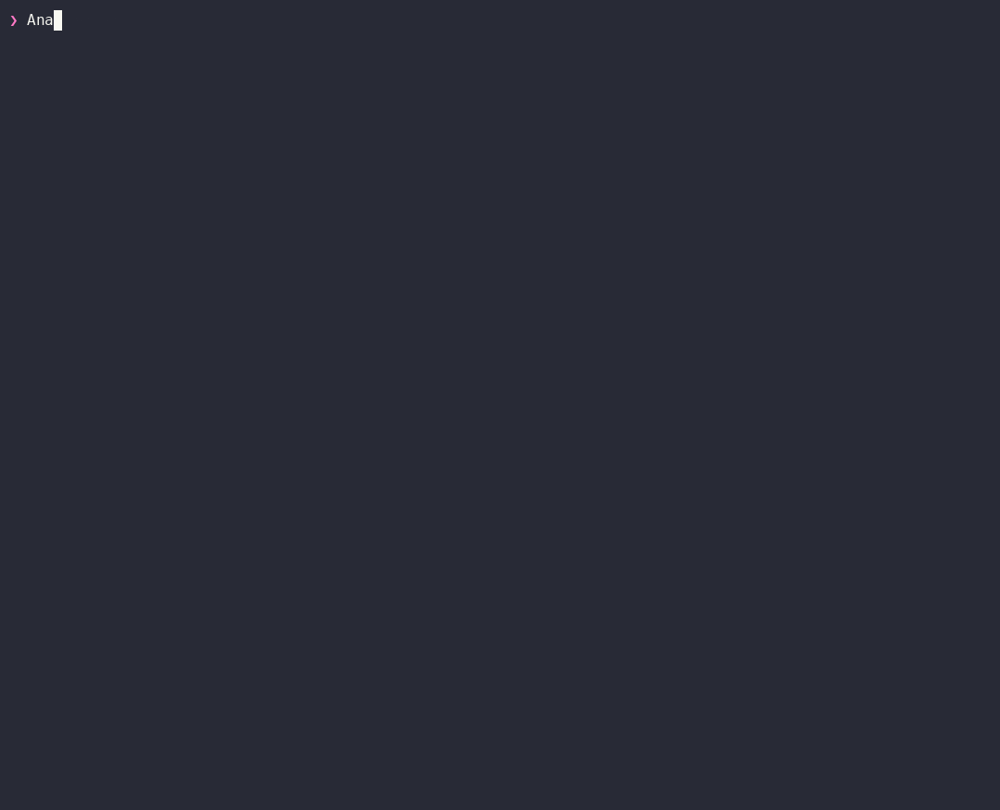

# Release readiness with bzr

The bundled `bzr-release-readiness` skill turns one bounded Bugzilla scope into a
read-only, evidence-backed report for a release decision. It accepts a Custom Search URL,
saved query, target milestone, version, or product and keeps facts, operator assumptions,
assessment, and data limitations distinct.



[Download the asciinema cast](assets/bzr-release-readiness-demo.cast) to replay the terminal
session with asciinema.

## Install and request a review

Install the embedded skill into the current Codex project:

```sh
bzr skills install --agent codex --project .
```

Then ask the agent for a release review and provide exactly one scope. For example:

> Analyze the latest release candidate in Bugzilla. Use product `Nimbus`, keep the review
> read-only, treat `RESOLVED` and `CLOSED` as complete, treat `Highest` priority or the
> `release-blocker` whiteboard marker as blocking, use 30 days for staleness and UTC for
> deadlines, include dependency risks, and return a PM-ready Markdown report.

The skill confirms rules that affect the outcome before collecting evidence. Its complete reads
use a positive page bound, pagination, stable bug-ID ordering, and an explicit field projection.
It supplements that scope only with documented read commands such as `bug view`, `bug history`,
`bug links`, `field list`, `server capabilities`, and `schema bug` when the requested checks need
them. It never seeds data or depends on a runtime helper script.

The resulting Markdown includes the scope and rules, headline assessment, blockers, dependency
risks, stale or unowned work, recent adverse changes, decisions needed, limitations, source
commands, generation time, and contributing bug IDs. Authorization can hide bugs and pagination
is a rolling snapshot, so the report names those limits rather than claiming an unobservable or
transactional total. Custom-field rules are used only when the server reports the field and its
operator contract.

## Regenerate the demo

The functional phase provisions the stable, release-shaped fixture in a real Bugzilla container
and proves all five scope forms plus the supplementary read commands. The recorder discovers the
latest marked fixture, creates only throwaway local query/profile state, and invokes the demo
helper out of view. The published terminal flow contains the agent-style request followed by the
final PM report; setup commands, helper plumbing, credentials, local paths, and the live server URL
are not shown.

Install `asciinema` 3 or newer, `agg`, `jq`, and `curl`, then run:

```sh
cargo build --release
make functional-test
BZR_BIN="$PWD/target/release/bzr" tools/record-demo.sh release-readiness
```

This regenerates `docs/assets/bzr-release-readiness-demo.cast` and
`docs/assets/bzr-release-readiness-demo.gif`. If the fixture is absent, the recorder stops and
asks for the functional test instead of mutating Bugzilla.
